# Hi there, I'm Tamil Selvan K! 👋

  

  

---

## 🚀 About Me

> **Passionate AI Product Engineer** turning cutting-edge AI research into **real-world solutions** that impact thousands of users.

- 🏢 **Founder & AI Product Engineer** at **LuzyTech**
- 🎓 **B.Tech in AI & Data Science** (CGPA: 7.8/10)
- 📍 **Based in Coimbatore, Tamil Nadu**
- 🎯 **Mission**: Building AI products that solve real problems
- 🌟 **Impact**: 800+ students mentored, 15+ client projects delivered

---

## 🏆 Key Achievements

| 🎯 **Metric** | 📊 **Value** | 🚀 **Impact** |
|---------------|--------------|---------------|
| **AI Interviews Conducted** | 800+ | Jon-the-Interviewer Platform |
| **Students Mentored** | 800+ | AI Workshops & Training |
| **Revenue Generated** | ₹4.2L+ | Institutional Contracts |
| **PCB Defect Detection** | 98% Accuracy | Industrial AI Solution |
| **Time Reduction** | 60% | Automated Inspection |
| **Client Websites** | 15+ | WordPress Development |

---

## 💼 Featured Products & Projects

### 🤖 [Jon-the-Interviewer](https://jon.luzy.in) - AI Mock Interview Platform
*Revolutionizing interview preparation with conversational AI*

**🎯 Problem Solved**: Traditional mock interviews lack real-time interaction
**✨ Solution**: AI-powered conversational interviews with adaptive questioning
**📊 Success**: 800+ interviews, ₹4.2L institutional deal, ₹12L project offer

**Tech Stack**: `Django` `FastAPI` `Streamlit` `LLM` `Voice AI` `Whisper`

---

### 📄 [ScanMyCV](https://scanmycv.luzy.in) - AI Resume Analyzer
*ATS-compatible resume optimization powered by AI*

**🎯 Problem Solved**: Job seekers don't understand ATS rejection reasons
**✨ Solution**: AI-driven resume analysis with improvement suggestions
**💡 Unique Value**: Acts like an ATS system, provides actionable feedback

**Tech Stack**: `NLP` `Streamlit` `Document Processing` `AI Analysis`

---

### 🤖 [ESP-Vision-Pro](https://github.com/classytamil/ESP-Vision-Pro) - Edge AI Object Detection
*Real-time object detection without cloud dependency*

**🎯 Problem Solved**: Cloud-based detection has latency and privacy issues
**✨ Solution**: Edge AI with ESP32-CAM + desktop processing
**⚡ Innovation**: Socket-based communication for minimal latency

**Tech Stack**: `ESP32-CAM` `OpenCV` `EfficientDet` `Socket Programming`

---

## 🛠️ Tech Stack & Skills

### 🤖 **AI & Machine Learning**

### 🌐 **Web Development**

### 🔧 **Hardware & IoT**

### 🗄️ **Databases & Tools**

---

## 📊 GitHub Analytics

---

## 🎯 Featured Repositories

---

## 🏅 Certifications & Recognition

| 🎓 **Certification** | 🏢 **Organization** | 📅 **Year** |
|---------------------|-------------------|-------------|
| PyTorch for Deep Learning | Scaler | 2023 |
| OpenCV Bootcamp | OpenCV University | 2023 |
| Digital 101 Journey | NASSCOM | 2023 |
| Chatbot Design | KGISL College | 2023 |

---

## 🌟 What Sets Me Apart

```mermaid
graph TD
    A[🎯 Problem Identification] --> B[🔧 Technical Solution]
    B --> C[👥 User-Centric Design]
    C --> D[🚀 Production Deployment]
    D --> E[📊 Real-World Impact]
    E --> F[💼 Business Value]
    F --> A
    
    style A fill:#e1f5fe
    style B fill:#f3e5f5
    style C fill:#e8f5e8
    style D fill:#fff3e0
    style E fill:#fce4ec
    style F fill:#e0f2f1
```

**💡 End-to-End Product Thinking**: From ideation to deployment with real user impact
**🚀 Proven Track Record**: Multiple successful products with quantified results
**📈 Business Acumen**: Understanding of both technical and commercial aspects
**🎓 Teaching & Mentoring**: 800+ students guided through practical AI learning
**⚡ Fast Execution**: Rapid prototyping and iterative development approach

---

## 📬 Let's Connect & Collaborate!

### 🤝 **Open for Exciting Opportunities!**

*Looking for challenging roles in AI Product Development, Machine Learning Engineering, or AI Consulting where I can leverage my proven track record of building successful AI products.*

**💼 Ideal Role**: Senior AI Engineer | AI Product Manager | ML Engineer | AI Consultant**

---

**⭐ Star my repositories if you find them useful! ⭐**

*"Building AI solutions that make a difference, one product at a time."* 🚀

